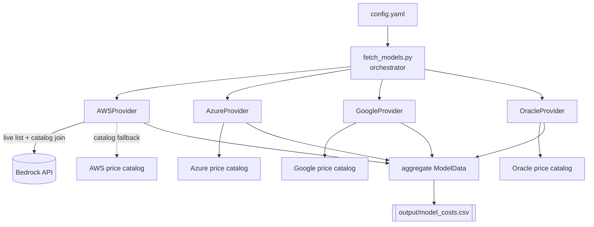
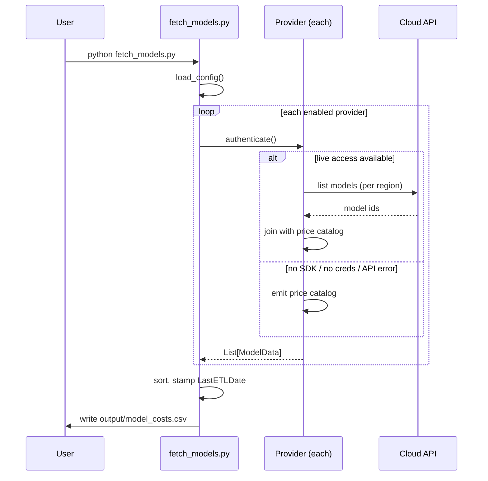

# Model Pricing Fetcher

Fetches LLM model pricing across cloud providers (AWS Bedrock, Azure OpenAI,
Google Vertex AI, Oracle GenAI) into a single, regenerable lookup CSV:
[`output/model_costs.csv`](output/model_costs.csv).

Run it whenever you want a fresh snapshot. Each run **replaces** the CSV and
stamps every row with `LastETLDate` (the run time, UTC ISO 8601).

## How pricing is sourced

Cloud LLM listing APIs generally **do not** return per-token prices, so
pricing lives in a **manually maintained catalog** inside each provider module
(`providers/*.py`). Two modes:

- **AWS Bedrock** performs *live model discovery* (`list_foundation_models`)
  per region and joins the result against its price catalog. Models not in the
  catalog are still listed, priced at `0` (a signal to add them).
- **Azure / Google / Oracle** are *catalog-based*: they emit their maintained
  catalog for each configured region. Live discovery can be layered on later
  without changing the CSV contract.

If a cloud SDK is missing or credentials/listing fail, the provider
**degrades gracefully** to catalog-only mode — you still get a useful CSV.

> ⚠️ **Verify prices before relying on them.** The catalog values are
> hand-maintained and drift as providers change pricing. Each module links to
> the official pricing page it was sourced from.

## Quick start

```bash
pip install -r requirements.txt   # PyYAML is the only hard requirement
python fetch_models.py
```

Output lands in `output/model_costs.csv`. Flags:

```bash
python fetch_models.py --config config.yaml --output output/model_costs.csv
```

## Configuration

Edit [`config.yaml`](config.yaml) to enable providers and set regions:

```yaml
providers:
  aws:
    enabled: true
    regions: [us-east-1]
  azure:
    enabled: true
    regions: [eastus]
  google:
    enabled: false
    regions: [us-central1]
  oracle:
    enabled: false
    regions: [us-phoenix-1]
```

## CSV schema

| column | meaning |
|--------|---------|
| `model_id` | provider's model identifier |
| `service` | hosting service — `AWS Bedrock`, `Azure OpenAI`, `Google Vertex AI`, `Oracle GenAI` |
| `provider` | model creator — `Anthropic`, `OpenAI`, `Meta`, ... |
| `region` | region code the row applies to |
| `input_cost_per_1k_tokens` | USD per 1,000 input tokens |
| `output_cost_per_1k_tokens` | USD per 1,000 output tokens |
| `LastETLDate` | UTC ISO 8601 timestamp of the run |

Rows are unique on `(service, region, model_id)` and sorted the same way.

## Architecture



All providers subclass `Provider` (or the `CatalogProvider` convenience base)
and return a list of `ModelData`. The orchestrator aggregates, sorts, and
writes — it never knows provider internals.

## Run sequence



Provider isolation: if one provider raises, the orchestrator logs it, keeps the
others, and exits `1` (partial CSV). Exit `0` = all clean, `2` = nothing
produced / bad config.

## Adding a provider

1. Create `providers/<name>.py`. For a catalog-only cloud:

   ```python
   from .base import Catalog, CatalogProvider

   MY_PRICING: Catalog = {"model-id": ("Creator", 0.001, 0.002)}

   class MyProvider(CatalogProvider):
       service_name = "My Service"
       catalog = MY_PRICING
   ```

   For live discovery, subclass `Provider` and implement `authenticate()` and
   `fetch_models()` (see `providers/aws.py`).

2. Register it in `PROVIDER_MAP` in `fetch_models.py`.
3. Add a config block in `config.yaml`.
4. Add tests in `tests/`.

## Testing

```bash
python -m pytest tests/ -v
```

Tests use fakes/stubs — no cloud credentials or network required.

## Running in CI (GitHub Actions)

The script is CI-friendly: point providers at credentials via repo secrets and
commit the refreshed CSV. Sketch:

```yaml
name: Refresh model pricing
on:
  schedule: [{ cron: "0 6 * * 1" }]   # Mondays 06:00 UTC
  workflow_dispatch:
jobs:
  fetch:
    runs-on: ubuntu-latest
    permissions: { contents: write }
    steps:
      - uses: actions/checkout@v4
      - uses: actions/setup-python@v5
        with: { python-version: "3.11" }
      - run: pip install -r requirements.txt
      - uses: aws-actions/configure-aws-credentials@v4
        with:
          role-to-assume: ${{ secrets.AWS_ROLE_ARN }}
          aws-region: us-east-1
      - run: python fetch_models.py
      - run: |
          git config user.name  "github-actions"
          git config user.email "github-actions@users.noreply.github.com"
          git add output/model_costs.csv
          git commit -m "chore: refresh model pricing" || echo "no changes"
          git push
```
